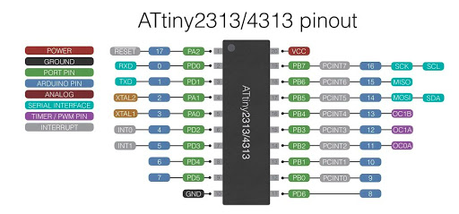
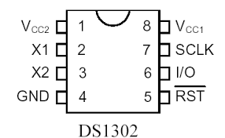
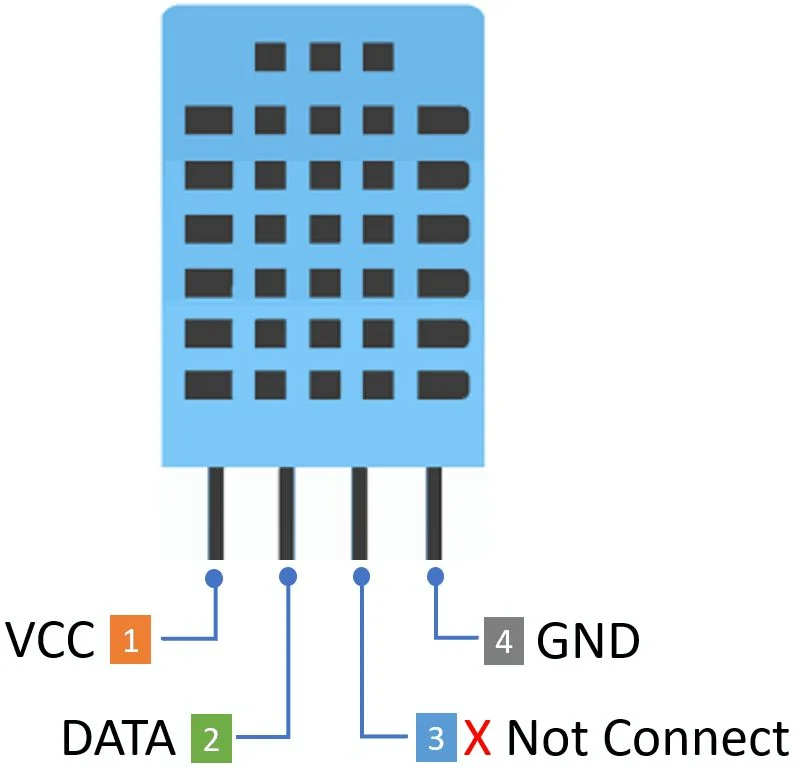
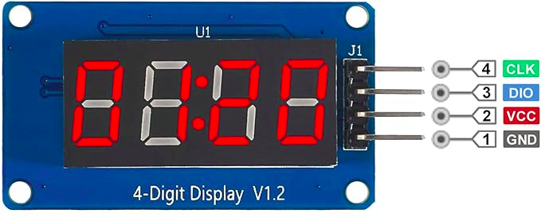

# 🕒 Digital Clock với ATtiny2313

## 📌 Giới thiệu

Dự án này là một **đồng hồ số (Digital Clock)** sử dụng vi điều khiển **ATtiny2313**, có khả năng:

* Hiển thị thời gian thực (RTC)
* Đo nhiệt độ/độ ẩm
* Cài đặt giờ báo thức
* Phát còi buzzer khi đến giờ

Hiển thị được thực hiện thông qua LED 7 đoạn **TM1637**, và người dùng tương tác bằng **4 nút nhấn (button)**.

---

## ⚙️ Phần cứng sử dụng

| Thành phần | Mô tả                                   |
| ---------- | --------------------------------------- |
| ATtiny2313 | Vi điều khiển chính                     |
| DS1302     | Module RTC (Real-Time Clock)            |
| DHT11      | Cảm biến nhiệt độ và độ ẩm              |
| TM1637     | LED 7 đoạn 4 digit                      |
| Button x4  | Điều khiển (mode, tăng, giảm, xác nhận) |
| Buzzer     | Còi báo thức                            |

---

## 🔌 Kết nối phần cứng

### 1. Vi điều khiển ATtiny2313

ATtiny2313 là bộ điều khiển trung tâm, chịu trách nhiệm:

* Giao tiếp với các module ngoại vi
* Xử lý dữ liệu thời gian và cảm biến
* Điều khiển hiển thị và buzzer
* Nhận input từ các nút nhấn



---

### 2. Module RTC DS1302

Giao tiếp sử dụng chuẩn **3-wire (bit-banging)**:

| Tín hiệu | Chân MCU |
| -------- | -------- |
| CE       | PD3      |
| SCLK     | PD1      |
| IO       | PD2      |



👉 Chức năng:

* Lưu và cung cấp thời gian thực (giờ, phút, giây)

---

### 3. Cảm biến DHT11

Giao tiếp theo chuẩn **1-wire custom protocol**:

| Tín hiệu | Chân MCU |
| -------- | -------- |
| DATA     | PD4      |



👉 Chức năng:

* Đo nhiệt độ môi trường
* Đo độ ẩm không khí

---

### 4. LED 7 đoạn TM1637

Giao tiếp **2-wire (CLK + DIO)**:

| Tín hiệu | Chân MCU |
| -------- | -------- |
| DIO      | PB0      |
| CLK      | PD6      |



👉 Chức năng:

* Hiển thị thời gian (HH:MM)
* Hiển thị nhiệt độ

---

### 5. Hệ thống nút nhấn

Sử dụng 4 nút để điều khiển hệ thống:

| Nút      | Chân MCU | Chức năng     |
| -------- | -------- | ------------- |
| Button 1 | PB1      | Chuyển chế độ |
| Button 2 | PB2      | Tăng giá trị  |
| Button 3 | PB3      | Giảm giá trị  |
| Button 4 | PB4      | Xác nhận / OK |

---

### 6. Buzzer

| Thiết bị | Chân MCU |
| -------- | -------- |
| Buzzer   | PD0      |

👉 Chức năng:

* Phát âm thanh khi đến giờ báo thức

---

## 📌 Ghi chú

* Toàn bộ chân được định nghĩa trong file `macro.h`
* Hệ thống sử dụng **GPIO trực tiếp**, không dùng peripheral chuyên dụng
* Các giao thức:

  * DS1302
  * DHT11
  * TM1637
    đều được triển khai bằng phương pháp **bit-banging**

---

## 🔄 Chế độ hoạt động

Hệ thống có các mode chính:

### 🟢 Mode 1: Hiển thị thời gian (RTC)

* Đọc dữ liệu từ DS1302
* Hiển thị lên TM1637 theo dạng:

  ```
  HH:MM
  ```

---

### 🟡 Mode 2: Hiển thị nhiệt độ (DHT11)

* Đọc dữ liệu từ DHT11
* Hiển thị:

  ```
  t°C:h% 
  ```

---

### 🔵 Mode 3: Cài đặt giờ

* Dùng button để:

  * Tăng/giảm giờ
  * Xác nhận

---

### 🟣 Mode 4: Cài đặt phút

* Tương tự set giờ
* Sau khi xác nhận → lưu vào biến alarm

---

## ⏰ Báo thức (Alarm)

* Người dùng cài:

  * Giờ
  * Phút
* Khi thời gian thực (DS1302) == thời gian cài:

  * Buzzer sẽ kêu

👉 Có thể:

* Tắt bằng nút nhấn
* Hoặc tự tắt sau thời gian

---

## 📡 Giao tiếp dữ liệu

### DS1302

* Gửi command → đọc/ghi thanh ghi
* Frame:

  ```
  [Command] → [Data]
  ```

---

### DHT11

* MCU gửi start signal
* DHT11 phản hồi
* Trả về 40 bit:

  ```
  Humidity + Temp + Checksum
  ```

---

### TM1637

* Gửi từng byte để hiển thị LED
* Điều khiển:

  * Segment
  * Brightness

---

## 🚀 Tính năng nổi bật

* Hiển thị thời gian thực
* Đo nhiệt độ môi trường
* Có báo thức
* Giao diện đơn giản bằng nút nhấn
* Chạy trên MCU nhỏ (ATtiny2313)

---

## 📷 Demo (nếu có)

> Thêm hình hoặc video tại đây

---

## 🛠️ Hướng phát triển

* Thêm hiển thị độ ẩm
* Thêm nhiều alarm
* Thêm lưu EEPROM
* Nâng cấp sang MCU mạnh hơn (ESP32 😎)

---